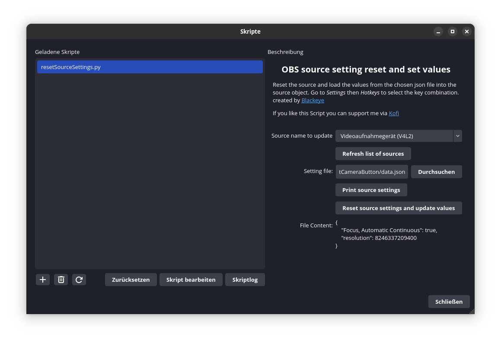

# Reset and overwrite values

This OBS-Script can reset and overwrite values of a source.

**But I can edit the values in the source setting and save them? Why Do I need a script for that?**

Thats right, but sometimes there are cases, where you need to reset the values and then set `your values`. Hence, OBS don't let you change default settings, you need to this on your own.
This can be (or at least it was for me) really cumbersome.

Thus I coded this script, which can do this for me.

**The Video freezes after pressing the reset button help?**
No worries, you just have to click on the resource and open it and save it.
Unfortunately I don't know (yet) how to restart the source so that this will not happen.

## Getting started

1. clone or download the repo or python file
2. Go to Tools->Scripts
3. load script into obs via file selector
4. press the load script button
5. Press `Print source settings` to see the source values
   1. `NOTE: you need to open the script log to see the values`
6. write your JSON file which holds the value that needs to be updated / set using the printed values
7. select file that contains the values that will be used for the update
   1. `NOTE: the values will be added to the source without checking if they are valid`
8. press `Reset source settings and update values`
9. additional: add a hotkey to the reset function

## Features

- reset the source
- update values, defined in json
- hotkey for reset function

## Customize Behaviour using Flags

within the script there can be flags set like that:

| FLAG      | VALUES  | DEFAULT |  DESCRIPTION |
| ------------- | ------------- | ------------- | ----------- |
| FILTERCLASS | obs.SOURCE_VIDEO,obs.SOURCE_AUDIO or  [see obs output flags](https://docs.obsproject.com/reference-sources#c.obs_source_info.output_flags) | obs.SOURCE_VIDEO | Filters the source name list (drop down list) for only audio or audio etc. |
| RESET | True,False | True | Determines if a reset should be done before updating the source settings|

### Additional Flags (more for development)

| FLAG      | VALUES  | DEFAULT |  DESCRIPTION |
| ------------- | ------------- | ------------- | ----------- |
| DEBUG | True,False  | False | Shows debug logs for debugging |
| USE_OBS_LOGS | True,False  | False | uses obs `blog` method for logging |

created by Blackeye / Blackstareye

## License

Distributed under the MIT License. See `LICENSE` for more information.

## Acknowledgements

Thank you for this resources:

- Awesome Cheatsheet: <https://github.com/upgradeQ/OBS-Studio-Python-Scripting-Cheatsheet-obspython-Examples-of-API/tree/master>
- Getting Startet: <https://obsproject.com/wiki/Getting-Started-With-OBS-Scripting>

## Support

If you like my work and want to support me and my work, then this is the way:

- [kofi](https://ko-fi.com/black_eye)

Many Thanks ♥
